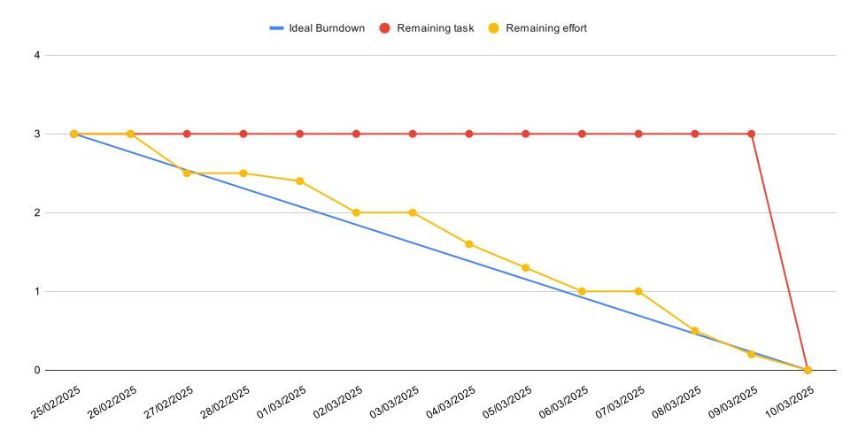

## 1. Product Backlog
En este apartado se mostraran todas las tareas que hay que desempeñar para llevar a cabo este proyecto.

| Tarea             | Descripción | Puntos | Prioridad |
|------------------|------------|--------|-----------|
| **Definir el problema** | Definir los diferentes aspectos del problema como son: Alcance del sistema, Objetivos del problema, Antecedentes, Recursos | 2 | Alta |
| **Brainstorming** | Realizar un brainstorming para decidir qué cambios implementar a los antecedentes de nuestra aplicación | 1 | Baja |
| **Definir Requisitos** | Identificar y especificar las necesidades y restricciones que el sistema debe cumplir para satisfacer las expectativas del usuario y los objetivos del negocio. | 3 | Media |
| **Validar Requisitos** | Asegurar que los requisitos definidos son correctos, completos y factibles, y que están alineados con las expectativas del cliente o usuario final. | 2 | Baja |
| **Definir Casos de Uso** | Describir las interacciones de los actores con el sistema, identificando las funcionalidades principales del sistema y los objetivos que se logran a través de esas interacciones. | 1 | Muy Alta |
| **Modelar Casos de Uso** | Detallar con mayor precisión los pasos específicos y secuenciales dentro de cada caso de uso. | 5 | Alta |
| **Diagrama Casos de Uso** | Diseñar un diagrama que muestre las relaciones entre los actores y los casos de uso, proporcionando una representación gráfica de los escenarios del sistema. | 2 | Muy Baja |
| **Diagramas de Actividad** | Crear diagramas que representen el flujo de trabajo y las acciones dentro de un proceso, mostrando cómo se desarrollan las actividades y cómo se interrelacionan. | 6 | Alta |
|||||
|||||
|||||
|||||
|||||

## 2. Sprint 1  

En este apartado se va a mostrar toda la información de los artefactos empleados en el segundo sprint del trabajo (25/02/2025 - 10/03/2025).  

### 2.1. Sprint Backlog  

En este primer sprint tenemos el siguiente Product Backlog:  

| Tarea             | Descripción | Puntos | Prioridad |
|------------------|------------|--------|-----------|
| **Definir el problema** | Definir los diferentes aspectos del problema como son: Alcance del sistema, Objetivos del problema, Antecedentes, Recursos | 2 | Alta |
| **Brainstorming** | Realizar un brainstorming para decidir qué cambios implementar a los antecedentes de nuestra aplicación | 1 | Baja |

### 3.2. Burndown Chart

## 3. Sprint 2  

En este apartado se va a mostrar toda la información de los artefactos empleados en el primer sprint del trabajo (11/03/2025 - 23/03/2025).  

### 3.1. Sprint Backlog  

En este segundo sprint tenemos el siguiente Product Backlog:  

| Tarea                 | Descripción | Puntos | Prioridad |
|----------------------|------------|--------|-----------|
| **Definir Requisitos** | Identificar y especificar las necesidades y restricciones que el sistema debe cumplir para satisfacer las expectativas del usuario y los objetivos del negocio. | 3 | Media |
| **Validar Requisitos** | Asegurar que los requisitos definidos son correctos, completos y factibles, y que están alineados con las expectativas del cliente o usuario final. | 2 | Baja |
| **Definir Casos de Uso** | Describir las interacciones de los actores con el sistema, identificando las funcionalidades principales del sistema y los objetivos que se logran a través de esas interacciones. | 1 | Muy Alta |
| **Modelar Casos de Uso** | Detallar con mayor precisión los pasos específicos y secuenciales dentro de cada caso de uso. | 5 | Alta |
| **Diagrama Casos de Uso** | Diseñar un diagrama que muestre las relaciones entre los actores y los casos de uso, proporcionando una representación gráfica de los escenarios del sistema. | 2 | Muy Baja |
| **Diagramas de Actividad** | Crear diagramas que representen el flujo de trabajo y las acciones dentro de un proceso, mostrando cómo se desarrollan las actividades y cómo se interrelacionan. | 6 | Alta |

### 3.2. Burndown Chart

