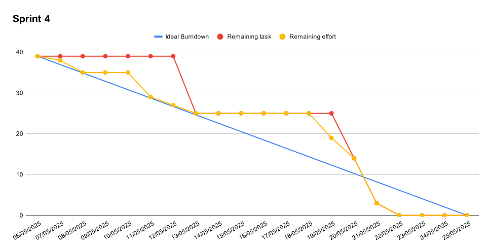

## 1. Product Backlog
En este apartado se mostraran todas las tareas que hay que desempeñar para llevar a cabo este proyecto.

| Tarea             | Descripción | Puntos | Prioridad |
|------------------|------------|--------|-----------|
| **Definir el problema** | Definir los diferentes aspectos del problema como son: Alcance del sistema, Objetivos del problema, Antecedentes, Recursos | 2 | Alta |
| **Brainstorming** | Realizar un brainstorming para decidir qué cambios implementar a los antecedentes de nuestra aplicación | 1 | Baja |
| **Definir Requisitos** | Identificar y especificar las necesidades y restricciones que el sistema debe cumplir para satisfacer las expectativas del usuario y los objetivos del negocio. | 3 | Media |
| **Validar Requisitos** | Asegurar que los requisitos definidos son correctos, completos y factibles, y que están alineados con las expectativas del cliente o usuario final. | 2 | Baja |
| **Definir Casos de Uso** | Describir las interacciones de los actores con el sistema, identificando las funcionalidades principales del sistema y los objetivos que se logran a través de esas interacciones. | 1 | Muy Alta |
| **Modelar Casos de Uso** | Detallar con mayor precisión los pasos específicos y secuenciales dentro de cada caso de uso. | 5 | Alta |
| **Diagrama Casos de Uso** | Diseñar un diagrama que muestre las relaciones entre los actores y los casos de uso, proporcionando una representación gráfica de los escenarios del sistema. | 2 | Muy Baja |
| **Diagramas de Actividad** | Crear diagramas que representen el flujo de trabajo y las acciones dentro de un proceso, mostrando cómo se desarrollan las actividades y cómo se interrelacionan. | 6 | Alta |
| **Diagrama de Contenidos** | Elaborar una estructura jerárquica que organice los contenidos del sistema, permitiendo visualizar qué información estará disponible y cómo se agrupará. | 3 | Media |
| **Diagrama de Usuarios** | Representar los distintos tipos de usuarios del sistema y sus características principales, facilitando el diseño centrado en el usuario. | 3 | Alta |
| **Diagrama de Navegación** | Diseñar la estructura de navegación del sistema, mostrando cómo se conectan entre sí las distintas vistas o páginas del sistema. | 4 | Alta |
| **Diagrama de Estructura de Proceso** | Mostrar la organización general de los procesos del sistema, identificando módulos o etapas clave en la ejecución del mismo. | 2 | Baja |
| **Diagramas de Flujo de Proceso** | Representar gráficamente las etapas de un proceso específico, detallando las decisiones, acciones y secuencia lógica de ejecución. | 1 | Muy Baja |
| **Diagramas de Presentación** | Diseñar la disposición visual de los elementos en las interfaces del sistema, facilitando una presentación clara y ordenada de la información. | 5 | Alta |
| **Crear tablas base de datos** | Diseñar e implementar las tablas necesarias para almacenar la información del sistema de forma estructurada y relacional | 2 | Muy Alta |
| **Vista menu principal** | Diseñar la interfaz principal del sistema, desde donde el usuario puede acceder a las funcionalidades principales | 2 | Alta |
| **Vista registro/inicio sesion** | Crear las pantallas para que el usuario pueda registrarse o iniciar sesión en el sistema | 2 | Media |
| **Vista seleccion de dificultad y modo de juego** | Crear la interfaz que permite al usuario elegir la dificultad y el tipo de juego antes de comenzar una partida | 2 | Alta |
| **Vista partida** | Diseñar la pantalla donde se desarrolla el juego o dinámica principal, mostrando los elementos interactivos según la lógica del juego | 3 | Alta |
| **Vista blog** | Crear la vista donde los usuarios pueden leer o publicar mensajes relacionados con el sistema o la temática del juego | 3 | Media |
| **Vista rankings** | 	Diseñar una vista que muestre los puntajes de los usuarios, permitiendo ver clasificaciones globales o de una partida | 3 | Media |
| **Vista tutorial** | Crear una pantalla que explique cómo usar el sistema o jugar, incluyendo instrucciones paso a paso | 1 | Media |
| **Estilos para personalizar la web** | Aplicar y ajustar estilos CSS que permitan modificar temas del sistema web | 3 | Baja |
| **Vista personalizar web** | Crear una pantalla para poder cambiar el tema de la aplicación | 1 | Baja |
| **Funcionalidad registro/inicio sesion** | Implementar el backend que permite al usuario crear cuentas y autenticarse en el sistema | 3 | Baja |
| **Funcionalidad partida** | Programar la lógica que permite ejecutar una partida, manejar las reglas, condiciones y resultados del juego | 4 | Muy Alta |
| **Funcionalidad ver ranking** | 	Implementar la funcionalidad que recupera y muestra los puntajes o clasificaciones de los usuarios | 2 | Alta |
| **Funcionalidad publicar mensaje** | Programar la opción para que los usuarios puedan escribir y publicar mensajes en el blog del sistema | 2 | Baja |
| **Funcionalidad personalizar web** | Desarrollar las opciones que permiten a los usuarios modificar la apariencia visual de la interfaz según preferencias | 3 | Baja |
| **Funcionalidad crear operacion** | Programar la generación dinámica de operaciones o retos que se presentarán al usuario durante la partida | 3 | Alta |

## 2. Sprint 1  

En este apartado se va a mostrar toda la información de los artefactos empleados en el segundo sprint del trabajo (25/02/2025 - 10/03/2025).  

### 2.1. Sprint Backlog  

En este primer sprint tenemos el siguiente Product Backlog:  

| Tarea             | Descripción | Puntos | Prioridad |
|------------------|------------|--------|-----------|
| **Definir el problema** | Definir los diferentes aspectos del problema como son: Alcance del sistema, Objetivos del problema, Antecedentes, Recursos | 2 | Alta |
| **Brainstorming** | Realizar un brainstorming para decidir qué cambios implementar a los antecedentes de nuestra aplicación | 1 | Baja |

### 3.2. Burndown Chart

## 3. Sprint 2  

En este apartado se va a mostrar toda la información de los artefactos empleados en el segundo sprint del trabajo (11/03/2025 - 23/03/2025).  

### 3.1. Sprint Backlog  

En este segundo sprint tenemos el siguiente Product Backlog:  

| Tarea                 | Descripción | Puntos | Prioridad |
|----------------------|------------|--------|-----------|
| **Definir Requisitos** | Identificar y especificar las necesidades y restricciones que el sistema debe cumplir para satisfacer las expectativas del usuario y los objetivos del negocio. | 3 | Media |
| **Validar Requisitos** | Asegurar que los requisitos definidos son correctos, completos y factibles, y que están alineados con las expectativas del cliente o usuario final. | 2 | Baja |
| **Definir Casos de Uso** | Describir las interacciones de los actores con el sistema, identificando las funcionalidades principales del sistema y los objetivos que se logran a través de esas interacciones. | 1 | Muy Alta |
| **Modelar Casos de Uso** | Detallar con mayor precisión los pasos específicos y secuenciales dentro de cada caso de uso. | 5 | Alta |
| **Diagrama Casos de Uso** | Diseñar un diagrama que muestre las relaciones entre los actores y los casos de uso, proporcionando una representación gráfica de los escenarios del sistema. | 2 | Muy Baja |
| **Diagramas de Actividad** | Crear diagramas que representen el flujo de trabajo y las acciones dentro de un proceso, mostrando cómo se desarrollan las actividades y cómo se interrelacionan. | 6 | Alta |

### 3.2. Burndown Chart

## 4. Sprint 3  

En este apartado se va a mostrar toda la información de los artefactos empleados en el tercer sprint del trabajo (01/04/2025 - 28/04/2025).

### 4.1. Sprint Backlog  

En este tercer sprint tenemos el siguiente Product Backlog: 

| Tarea                 | Descripción | Puntos | Prioridad |
|----------------------|------------|--------|-----------|
| **Diagrama de Contenidos** | Elaborar una estructura jerárquica que organice los contenidos del sistema, permitiendo visualizar qué información estará disponible y cómo se agrupará. | 3 | Media |
| **Diagrama de Usuarios** | Representar los distintos tipos de usuarios del sistema y sus características principales, facilitando el diseño centrado en el usuario. | 3 | Alta |
| **Diagrama de Navegación** | Diseñar la estructura de navegación del sistema, mostrando cómo se conectan entre sí las distintas vistas o páginas del sistema. | 4 | Alta |
| **Diagrama de Estructura de Proceso** | Mostrar la organización general de los procesos del sistema, identificando módulos o etapas clave en la ejecución del mismo. | 2 | Baja |
| **Diagramas de Flujo de Proceso** | Representar gráficamente las etapas de un proceso específico, detallando las decisiones, acciones y secuencia lógica de ejecución. | 1 | Muy Baja |
| **Diagramas de Presentación** | Diseñar la disposición visual de los elementos en las interfaces del sistema, facilitando una presentación clara y ordenada de la información. | 5 | Alta |

### 4.2. Burndown Chart

## 5. Sprint 4  

En este apartado se va a mostrar toda la información de los artefactos empleados en el cuarto sprint del trabajo (06/05/2025 - 25/05/2025).

### 5.1. Sprint Backlog  

En este cuarto sprint tenemos el siguiente Product Backlog: 

| Tarea                 | Descripción | Puntos | Prioridad |
|----------------------|------------|--------|-----------|
| **Crear tablas base de datos** | Diseñar e implementar las tablas necesarias para almacenar la información del sistema de forma estructurada y relacional | 2 | Muy Alta |
| **Vista menu principal** | Diseñar la interfaz principal del sistema, desde donde el usuario puede acceder a las funcionalidades principales | 2 | Alta |
| **Vista registro/inicio sesion** | Crear las pantallas para que el usuario pueda registrarse o iniciar sesión en el sistema | 2 | Media |
| **Vista seleccion de dificultad y modo de juego** | Crear la interfaz que permite al usuario elegir la dificultad y el tipo de juego antes de comenzar una partida | 2 | Alta |
| **Vista partida** | Diseñar la pantalla donde se desarrolla el juego o dinámica principal, mostrando los elementos interactivos según la lógica del juego | 3 | Alta |
| **Vista blog** | Crear la vista donde los usuarios pueden leer o publicar mensajes relacionados con el sistema o la temática del juego | 3 | Media |
| **Vista rankings** | 	Diseñar una vista que muestre los puntajes de los usuarios, permitiendo ver clasificaciones globales o de una partida | 3 | Media |
| **Vista tutorial** | Crear una pantalla que explique cómo usar el sistema o jugar, incluyendo instrucciones paso a paso | 1 | Media |
| **Estilos para personalizar la web** | Aplicar y ajustar estilos CSS que permitan modificar temas del sistema web | 3 | Baja |
| **Vista personalizar web** | Crear una pantalla para poder cambiar el tema de la aplicación | 1 | Baja |
| **Funcionalidad registro/inicio sesion** | Implementar el backend que permite al usuario crear cuentas y autenticarse en el sistema | 3 | Baja |
| **Funcionalidad partida** | Programar la lógica que permite ejecutar una partida, manejar las reglas, condiciones y resultados del juego | 4 | Muy Alta |
| **Funcionalidad ver ranking** | 	Implementar la funcionalidad que recupera y muestra los puntajes o clasificaciones de los usuarios | 2 | Alta |
| **Funcionalidad publicar mensaje** | Programar la opción para que los usuarios puedan escribir y publicar mensajes en el blog del sistema | 2 | Baja |
| **Funcionalidad personalizar web** | Desarrollar las opciones que permiten a los usuarios modificar la apariencia visual de la interfaz según preferencias | 3 | Baja |
| **Funcionalidad crear operacion** | Programar la generación dinámica de operaciones o retos que se presentarán al usuario durante la partida | 3 | Alta |

### 5.2. Burndown Chart

